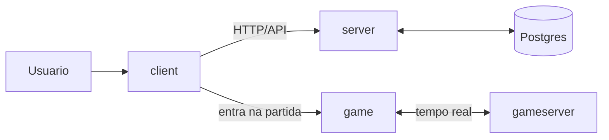

# BomberManos

BomberManos e um projeto de jogo multiplayer baseado em partidas.

Arquiteturalmente, o sistema caminha para duas camadas complementares:

- plataforma: autenticacao, sessao, matchmaking e persistencia duravel;
- partida em tempo real: cada partida como um micro universo com seu proprio estado e sua propria fonte de verdade.

No desenho alvo do projeto:

- `client/`: app web principal para entrada, conta e fluxo fora da simulacao;
- `server/`: camada de plataforma e orquestracao;
- `game/`: frontend especializado da partida;
- `gameserver/`: backend especializado da partida;
- `sql/`: schema e bootstrap da persistencia permanente em Postgres.

Hoje, porem, o fluxo realmente funcional ainda esta concentrado em `client + server`. A extracao completa da camada de jogo em tempo real ainda esta em andamento.

## Arquitetura em uma leitura rapida



Leitura correta desse diagrama:

- ele representa a arquitetura alvo;
- o caminho ativo hoje ainda nao usa `game/` e `gameserver/` como pipeline principal da partida;
- o runtime atual ainda executa matchmaking e game loop dentro de `server/`.

## Status atual

- O `server/` serve o build do `client/` e tambem expoe HTTP, HTTPS e Socket.IO.
- O estado ativo de usuarios, sessoes e partidas ainda depende fortemente de arquivos locais em `server/data/` e de memoria de processo.
- O `gameserver/` ja sobe como servico separado, mas seus handlers ainda estao essencialmente vazios.
- O `game/` ja materializa um cliente de partida em canvas, mas ainda esta fora do fluxo principal do produto.
- O schema SQL em `sql/` e o Postgres do `docker-compose.yml` representam a persistencia duravel pretendida, embora ainda nao sejam a fonte principal de verdade do runtime.

## Estrutura do repositorio

```text
.
|- client/      App web principal
|- server/      Plataforma atual + game loop atual
|- gameserver/  Backend de jogo dedicado em evolucao
|- game/        Frontend de jogo dedicado em prototipo
|- sql/         Bootstrap e schema de Postgres
|- docs/        Documentacao para humanos
|- .opencode/   Skills locais para OpenCode
|- AGENTS.md    Regras de projeto para agentes
|- opencode.json
```

## Como pensar o sistema hoje

### Plataforma

Cuida de:

- conta e autenticacao;
- sessao;
- matchmaking;
- descoberta ou alocacao de partida;
- persistencia permanente.

### Partida

Cuida de:

- estado vivo do mapa;
- jogadores conectados;
- sincronizacao em tempo real;
- regras da simulacao;
- resultado da partida.

### Diferenca entre alvo e implementacao atual

- Arquitetura alvo: `server` e `gameserver` separados por responsabilidade.
- Implementacao atual: `server` ainda concentra plataforma e simulacao principal.
- Arquitetura alvo: Postgres como persistencia permanente.
- Implementacao atual: `server/data/` ainda e a persistencia principal do runtime.
- Arquitetura alvo: `game` conversa com `gameserver` como frontend especializado da partida.
- Implementacao atual: `client` conversa com `server`, e `game` segue como prototipo separado.

## Setup rapido

### Requisitos

- Node.js com npm
- Docker ou Docker Compose

### Instalar dependencias

```bash
npm run install
```

### Subir Redis, Postgres e SeaweedFS

```bash
docker compose up -d
```

O compose sobe Redis Stack, Postgres 16 Alpine e SeaweedFS (object storage S3-compatible). O schema do banco e inicializado automaticamente via `sql/constructor.sql`.

A conexao padrao do Postgres e:

```bash
postgres://postgres@localhost/bombermanos
```

O endpoint S3 do SeaweedFS:

```bash
http://localhost:8333
```

### Variaveis de ambiente

Copie `.env.example` e ajuste:

```bash
cp .env.example .env
```

Variaveis:

| Variavel | Padrao | Descricao |
|----------|--------|-----------|
| `PORT` | `3000` | Porta HTTP do `server` (HTTPS = PORT+1) |
| `GAMESERVER_PORT` | `4000` | Porta HTTP do `gameserver` |
| `POSTGRES` | — | String de conexao Postgres |
| `SESSION_SECRET` | `jacareperneta` | Segredo da sessao (troque em producao) |
| `CORS_ORIGINS` | — | Origins CORS separados por virgula |
| `SEAWEEDFS_S3_ENDPOINT` | `http://localhost:8333` | Endpoint S3 do SeaweedFS |
| `SEAWEEDFS_ACCESS_KEY` | `admin` | Chave de acesso do SeaweedFS |
| `SEAWEEDFS_SECRET_KEY` | `secret` | Chave secreta do SeaweedFS |

## Fluxos de execucao

### Dev mode completo — `npm run dev` (recomendado)

```bash
docker compose up -d
npm run dev
```

Acesse **`http://localhost:3000`** — o server serve o client buildado.

- Builda automaticamente client, server e gameserver
- Depois mantem watch em todos (recompila ao salvar)
- Se as portas `3000/3001/4000/4001` ja estiverem ocupadas, o comando falha cedo com aviso para evitar subir um stack quebrado
- `gameserver` em `http://localhost:4000`

Se precisar limpar uma sessao antiga de desenvolvimento, rode:

```bash
npm run dev:stop
```

### Dev mode com Vite (HMR) — `npm run dev:vite`

```bash
docker compose up -d
npm run dev:vite
```

Acesse **`http://localhost:5173`** — Vite com HMR + proxy para o backend.

- O Vite faz proxy de `/user`, `/match` e `/socket.io` para `localhost:3000`
- Se as portas `3000/3001/4000/4001` ja estiverem ocupadas, o comando falha cedo com aviso
- `localhost:3000` só tem as rotas HTTP e Socket.IO (sem frontend)
- `gameserver` em `http://localhost:4000`

## Scripts principais

| Escopo | Comando | Uso |
| --- | --- | --- |
| raiz | `docker compose up -d` | sobe Redis Stack e Postgres 16 Alpine |
| raiz | `npm run install` | instala dependencias de `client`, `server` e `gameserver` |
| raiz | `npm run start:login` | builda `client`, builda `server` e sobe o backend principal |
| raiz | `npm run start:game` | builda e sobe `gameserver` |
| raiz | `npm run dev` | server (3000), gameserver (4000) e client build em paralelo |
| raiz | `npm run dev:vite` | Vite (5173) com proxy + server + gameserver em paralelo |
| client | `npm run dev-vite` | sobe o servidor Vite com proxy para backend |
| client | `npm run dev` | watch helper; nao sobe o Vite |
| client | `npm run build` | build de producao do frontend |
| server | `npm run dev` | watch TypeScript + restart do backend |
| server | `npm run build` | compila o backend principal |
| gameserver | `npm run dev` | watch TypeScript + restart do backend de jogo |
| gameserver | `npm run build` | compila o backend de jogo |
| game | `npm run build` | build do prototipo standalone |

## Documentacao

- `docs/architecture.md`: arquitetura alvo, estado atual, limites de responsabilidade e ciclo de vida da partida
- `docs/transformation-plan.md`: plano tecnico para sair da codebase atual e chegar na arquitetura alvo
- `docs/development.md`: setup local, comandos e caveats
- `docs/opencode.md`: como usar OpenCode neste repositorio
- `AGENTS.md`: instrucoes de alto nivel para agentes
- `client/AGENTS.md`, `server/AGENTS.md`, `gameserver/AGENTS.md`, `game/AGENTS.md`, `sql/AGENTS.md`: instrucoes locais por area

## Documentacao para agentes

Este repositorio agora inclui:

- `AGENTS.md` no root, conforme a recomendacao oficial do OpenCode
- `opencode.json` com `instructions` para carregar instrucoes adicionais do monorepo
- skills locais em `.opencode/skills/`

As escolhas acima seguem a documentacao oficial:

- `https://opencode.ai/docs/rules/`
- `https://opencode.ai/docs/skills/`
- `https://opencode.ai/docs/agents/`
- `https://opencode.ai/docs/config/`

## Caveats importantes

- `server` padrao porta 3000; `gameserver` padrao porta 4000 (agora sem conflito)
- `server` serve `../client/build` — para HMR use `npm run dev:vite`
- Certificados TLS de desenvolvimento versionados
- Schema SQL referencia `characters(id)` sem a tabela existir
- `SESSION_SECRET` tem fallback fixo (`jacareperneta`) — configure via `.env` em producao
- Persistencia ativa do runtime ainda e em arquivos JSON (`server/data/`), nao em Postgres
- `gameserver/` e `game/` ja apontam a arquitetura futura, mas ainda nao substituem o fluxo principal atual
- Object storage e SeaweedFS (S3-compatible) — MinIO foi arquivado e nao deve ser usado em projetos novos
