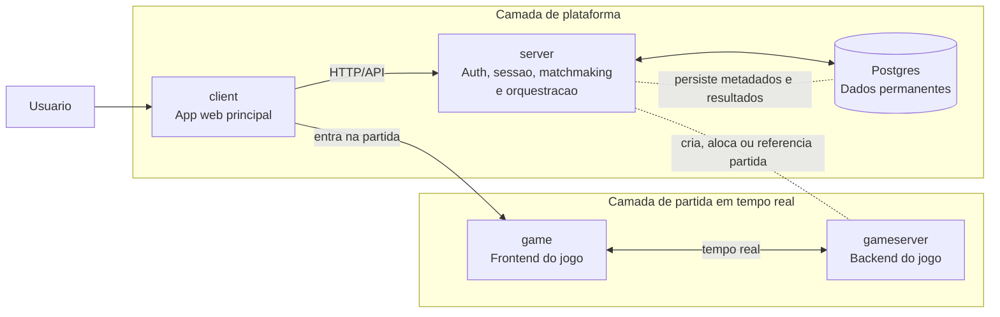
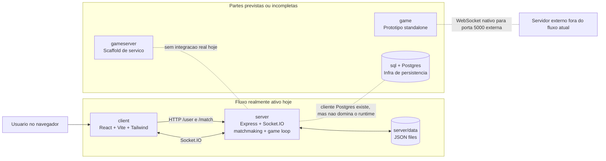
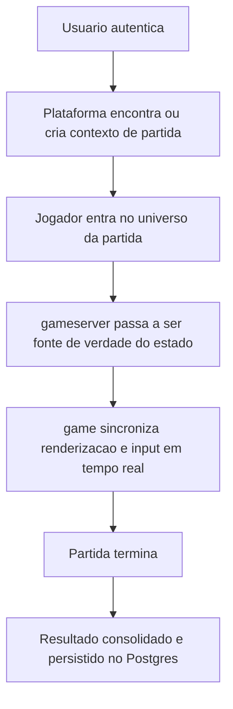
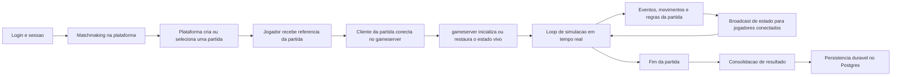

# Arquitetura

## Visao geral

O sistema deve ser entendido em duas camadas arquiteturais:

- a camada de plataforma, responsavel por identidade, persistencia e ciclo de vida das partidas;
- a camada de jogo em tempo real, onde cada partida tende a funcionar como um micro universo com sua propria fonte de verdade.

No desenho pretendido do projeto:

- `game/` representa o frontend especializado do jogo em tempo real;
- `gameserver/` representa o backend especializado do jogo em tempo real;
- `server/` representa a camada de aplicacao e plataforma fora da simulacao da partida;
- `sql/` e Postgres representam a persistencia permanente;
- `client/` representa a interface web principal hoje usada para login, home, matchmaking e entrada na partida.

Ao mesmo tempo, o repositorio ainda esta em transicao. O runtime realmente implementado hoje continua concentrado em `client + server`, e a parte de regras do jogo ainda esta inicial.

## Arquitetura alvo

## Estado atual no repositorio

## Principio central do dominio

O projeto visa um jogo multiplayer baseado em partidas. A unidade principal de execucao e a partida.

Cada partida deve evoluir para um micro universo isolado, com:

- estado proprio;
- regras proprias em execucao;
- sincronizacao em tempo real entre clientes conectados;
- uma fonte de verdade concentrada no backend da partida.

Nesse modelo, a fonte de verdade da simulacao nao deve ficar na camada de plataforma, mas no par `game/` e `gameserver/`.

## Separacao de responsabilidades

### Plataforma

A camada de plataforma cuida do que existe antes, durante e depois da partida, mas nao da simulacao em si.

Responsabilidades esperadas:

- autenticacao;
- sessao;
- cadastro de usuario;
- matchmaking;
- descoberta ou alocacao da partida;
- persistencia duravel de dados de conta, progresso, inventario e historico;
- consolidacao de resultados permanentes.

No repositorio, esse papel aparece principalmente em `server/`, com apoio de `sql/` como base de persistencia planejada.

### Partida em tempo real

A camada de partida cuida do universo vivo do jogo.

Responsabilidades esperadas:

- estado corrente do mapa;
- jogadores conectados naquela partida;
- objetos dinamicos e eventos do jogo;
- sincronizacao em tempo real;
- regras do jogo e resolucao de conflitos;
- encerramento da partida e emissao do resultado.

No desenho pretendido:

- `game/` e o frontend especializado da partida;
- `gameserver/` e o backend especializado da partida.

## Papel de cada pasta

| Pasta | Papel arquitetural alvo | Estado verificado hoje |
| --- | --- | --- |
| `client/` | Portal/app web principal fora da simulacao | Ativo; faz login, home, matchmaking e renderiza o jogo atual via `server/` |
| `server/` | Plataforma e orquestracao fora da partida | Ativo; ainda concentra auth, sessao, matchmaking e tambem o game loop atual |
| `gameserver/` | Backend especializado por partida | Existe, sobe Express + Socket.IO, mas os handlers ainda estao vazios |
| `game/` | Frontend especializado do jogo em tempo real | Existe como prototipo standalone com canvas e WebSocket nativo |
| `sql/` | Modelo relacional e bootstrap da persistencia duravel | Existe; schema inicial montado no Postgres via Docker/manual |

## Verificacao no codebase

### `gameserver/`

O codebase confirma a direcao de separacao do backend de jogo, mas ainda nao a implementacao completa:

- `gameserver/src/index.ts` sobe Express, CORS, HTTP/HTTPS e Socket.IO;
- `gameserver/src/connection/index.ts` cria os servidores Socket.IO, mas o handler de `connection` esta vazio;
- `gameserver/src/router/index.ts` segue sem fluxo real relevante;
- `gameserver/src/clients/postgres/index.ts` mostra preparacao para acesso relacional;
- `gameserver/src/clients/redis/` ainda esta vazio.

Conclusao: a pasta sustenta a intencao arquitetural de um backend de jogo dedicado, mas ainda esta como scaffold.

### `game/`

O codebase confirma a ideia de um frontend de jogo separado do app principal:

- ha renderer em canvas;
- ha hierarquia de objetos, sprites, mapas e input;
- ha cliente WebSocket proprio em `game/src/connection/index.ts`.

Ao mesmo tempo, ele ainda e prototipo:

- usa WebSocket nativo, nao Socket.IO;
- aponta para `wss://...:5000`, fora do fluxo principal do monorepo;
- nao esta integrado ao `gameserver/` atual.

Conclusao: a pasta ja materializa a ideia de frontend de partida, mas ainda nao faz parte do caminho principal do produto.

### `server/`

O codebase confirma que a camada de plataforma existe, mas tambem mostra que o jogo ainda nao foi extraido dela:

- auth e sessao vivem aqui;
- rotas `/user` e `/match` vivem aqui;
- o build do `client/` e servido daqui;
- matchmaking roda daqui;
- o game loop atual ainda vive em `server/src/services/game/data.ts`.

Conclusao: hoje `server/` e um backend monolitico de transicao, acumulando plataforma e simulacao da partida.

### `sql/` e Postgres

O codebase confirma a intencao de persistencia real e permanente:

- `docker-compose.yml` sobe Postgres e monta `sql/constructor.sql` e `sql/views.sql`;
- `sql/constructor.sql` modela usuarios, informacoes de usuario, partidas e relacoes de participacao;
- existem clientes Postgres em `server/` e `gameserver/`.

Mas o runtime principal ainda nao usa essa persistencia como fonte de verdade:

- `server/` ainda persiste usuarios e sessoes em arquivos JSON;
- partidas ativas ainda vivem em memoria do processo.

Conclusao: Postgres ja faz parte da arquitetura pretendida e da infraestrutura do repositorio, mas ainda nao domina o fluxo real executado hoje.

## Persistencia

### Persistencia permanente pretendida

Os dados permanentes do sistema devem viver em Postgres, por exemplo:

- usuarios;
- perfis;
- progresso;
- inventario;
- configuracoes duraveis;
- historico e resultado consolidado das partidas.

Essa separacao permite que a camada de plataforma escale de forma diferente da camada de partidas em tempo real.

### Persistencia transiente da partida

O estado vivo de cada partida deve ficar no backend da partida durante sua execucao.

Exemplos:

- posicao de jogadores;
- estado do mapa;
- bombas, explosoes e destruicao;
- temporizadores;
- eventos em tempo real;
- estado intermediario nao duravel.

Esse estado pode ser descartavel ao final da partida, restando apenas a persistencia do resultado necessario.

### Persistencia realmente usada hoje

Hoje o repositorio ainda esta em um estagio intermediario:

- `server/data/` e a persistencia principal em runtime;
- `server/src/database/index.ts` opera sobre arquivos locais;
- Postgres esta preparado, mas nao e o centro do fluxo ativo.

## Escalabilidade pretendida

O desenho descrito sugere duas estrategias diferentes de escala:

- a camada de plataforma pode escalar em torno de HTTP, sessao, persistencia e operacoes duraveis;
- a camada de partidas pode escalar em torno de muitas simulacoes concorrentes, com trafego intenso e estado em tempo real por partida.

Arquiteturalmente, isso favorece tratar cada partida como uma unidade isolavel de processamento.

Hoje, porem, essa separacao ainda nao foi concluida, porque o game loop ativo segue em `server/`.

## Fluxo conceitual de uma partida

## Ciclo de vida detalhado de uma partida

Leitura desse ciclo:

- a plataforma e dona do acesso, da sessao e do matchmaking;
- o `gameserver` deve se tornar dono do estado vivo da partida;
- o `game` deve consumir esse estado em tempo real e refletir input do jogador;
- ao final, apenas o resultado necessario volta para a persistencia duravel.

## Implementacao atual desse fluxo

Hoje esse fluxo ainda esta comprimido:

- autenticacao, matchmaking e simulacao ainda passam por `server/`;
- `client/` conversa com `server/` por HTTP e Socket.IO;
- `game/` e `gameserver/` ainda nao formam o pipeline ativo de uma partida real.

## Estado das regras do jogo

As regras do jogo ainda estao em formacao.

O objetivo do projeto e evoluir para um jogo no estilo Bomberman, mas isso ainda nao esta consolidado no codebase atual.

Hoje ja existem sinais iniciais de simulacao, como:

- mapa com tiles e blocos;
- objetos e personagens;
- movimentacao;
- estruturas de partida e jogadores.

Mas ainda faltam as regras centrais que definem claramente o jogo, como por exemplo:

- bombas;
- explosoes;
- destruicao de blocos;
- power-ups;
- regras de vitoria e derrota;
- ritmo completo da partida;
- consistencia entre frontend e backend da simulacao.

## Tensao arquitetural atual

O repositorio guarda ao mesmo tempo:

- a arquitetura desejada, com plataforma separada da simulacao por partida;
- a implementacao atual, ainda monolitica no `server/` para o fluxo principal;
- experimentos e scaffolds que apontam para a futura extracao.

Isso significa que a documentacao correta hoje precisa sempre distinguir:

- o que ja esta operando;
- o que ja esta representado em codigo, mas incompleto;
- o que ainda e direcao de produto e arquitetura.

## Proxima leitura recomendada da arquitetura

Se alguem entrar neste repositorio hoje, a leitura mais fiel e:

1. o produto funcional atual e `client + server`;
2. a arquitetura alvo aponta para separar plataforma e partida em tempo real;
3. `game/` e `gameserver/` sao a base dessa separacao futura;
4. Postgres e a persistencia duravel pretendida, embora o runtime principal ainda use arquivos locais;
5. o jogo final estilo Bomberman ainda esta em construcao no nivel de regras.

## Nota sobre Mermaid neste arquivo

Os diagramas acima usam a forma recomendada pela documentacao atual do Mermaid em Markdown: bloco fenced com identificador `mermaid`, seguido da declaracao do tipo de diagrama, como `flowchart LR` ou `flowchart TB`.
